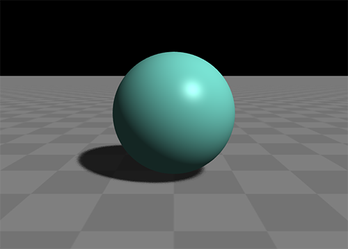

Glass Engine -- 易用的 Python 3D 渲染引擎
================================================================

**Glass Engine** 是一个相当易用的 Python 实时 3D 渲染引擎，完全免费开源。使用 **Glass Engine** 你可以轻松地在你的 Python 界面程序中嵌入可交互的 3D 画面。

首先，使用以下命令即可完成对 **Glass Engine** 的安装，

::

    pip install glass-engine

如果你是中国区用户，使用以下命令则可以加速安装过程：

::

    pip install glass-engine -i https://pypi.tuna.tsinghua.edu.cn/simple

接下来，让我们通过一个简单例子来直观感受一下 **Glass Engine** 的使用过程：

.. highlight:: python3

::

    from glass_engine import *
    from glass_engine.Geometries import * # 导入所有的基本几何体

    scene, camera, light, floor = SceneRoam() # 创建基本场景

    sphere = Sphere() # 创建一个球体模型
    sphere.position.z = 1 # 设置球体位置
    scene.add(sphere) # 将球体添加到场景中

    camera.screen.show() # 相机显示屏显示渲染结果

上述代码首先使用 ``SceneRoam`` 创建出一个基本场景，包括了相机、光源、地板，然后往场景中添加了一个球体模型，最后将相机观察到的视口显示出来。

可以看出，使用 **Glass Engine** 创建 3D 场景无需自定义任何类和任何函数，仅通过对象创建、方法调用的顺序程序结构就可完成场景的构建和显示，由此体现出 **Glass Engine** 高度的易用性，这也是 **Glass Engine** 相比于其他同类 3D 引擎的优势所在。

运行上述程序，你将得到下图所示结果：

你可以通过鼠标右键拖动以旋转视角，还可通过键盘按键 :kbd:`W` :kbd:`A` :kbd:`S` :kbd:`D` :kbd:`E` :kbd:`C` 来在场景中漫游：

- :kbd:`A` 向左移动，:kbd:`D` 向右移动
- :kbd:`W` 向前移动，:kbd:`S` 向后移动
- :kbd:`E` 向上移动，:kbd:`C` 向下移动

怎么样，是不是很简单、直观、易用？如果你感兴趣的话，就让我们开始接下来的 3D 渲染之旅吧！

- `文档 <https://glass-engine-doc.readthedocs.io/zh/latest/>`_
- `PyPI 索引 <https://pypi.org/project/glass-engine>`_
